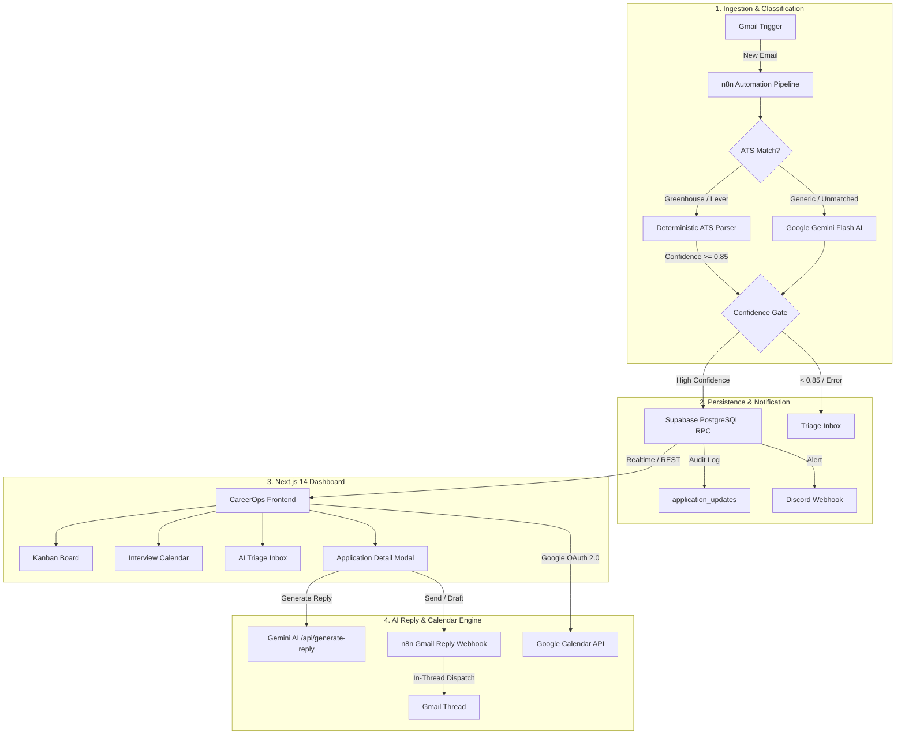

<div align="center">

# 🤖 CareerOps: AI Job Application Tracker & Recruiter Reply Engine

**An intelligent, Linear-inspired job application operating system powered by Next.js 14, Supabase, n8n, Google Gemini AI, Google Calendar, and Gmail.**

[](https://nextjs.org/)
[](https://react.dev/)
[](https://www.typescriptlang.org/)
[](https://tailwindcss.com/)
[](https://supabase.com/)
[](https://n8n.io/)
[](https://ai.google.dev/)
[](https://discord.com/)
[](https://nodejs.org/)
[](https://drive.google.com/file/d/1_ZlKY-SFtT1_Y6fyv-04VTkCMmuV2dTP/view)

[Overview](#-overview) • [Demo Video](#-product-demo-video) • [Recent Updates](#-recent-updates) • [Key Features](#-key-features) • [Architecture](#-architecture) • [Project Structure](#-project-structure) • [Quick Start](#-quick-start) • [n8n Automation Setup](#-n8n-automation-setup) • [Keyboard Shortcuts](#-keyboard-shortcuts)

</div>

---

## 🎬 Product Demo Video

[](https://drive.google.com/file/d/1_ZlKY-SFtT1_Y6fyv-04VTkCMmuV2dTP/view)

> 📺 **[Watch the Full CareerOps Walkthrough on Google Drive](https://drive.google.com/file/d/1_ZlKY-SFtT1_Y6fyv-04VTkCMmuV2dTP/view)**  
> See the end-to-end workflow in action: automated Gmail ingestion, deterministic Greenhouse & Lever parsing, Gemini AI Recruiter Reply Assistant with custom instructions, 1-click in-thread Gmail dispatch, and Google Calendar 2-way synchronization.

---

## 🚀 Overview

Job hunting across dozens of companies often leads to lost recruiter emails, delayed interview replies, and fragmented tracking. **CareerOps** solves this by uniting **automated email ingestion, AI-powered reply drafting, and Google Calendar synchronization** with a **high-speed, desktop-class web dashboard**:

1. **Automated Ingestion**: An **n8n** pipeline monitors your Gmail for recruiter messages and job status changes.
2. **Deterministic ATS Engine**: Instant regex-based parsing for **Greenhouse** and **Lever** emails with 0.98 confidence (zero API cost and zero latency).
3. **Google Gemini AI Classification**: Extracts company, role, stage, summary, next steps, and confidence scores for non-templated recruiter messages.
4. **AI Recruiter Reply Assistant**: Drafts tailored responses matching your goal (accept, reschedule, acknowledge test, clarify) and allows **1-click sending or drafting directly into the Gmail thread**.
5. **2-Way Google Calendar Synchronization**: Automatically maps interviews, sets reminders, and resolves calendar conflicts.
6. **Linear-Style Frontend**: A modern dark/light mode dashboard built with Next.js 14, Radix UI, Framer Motion, and Lucide React.

---

## 🌟 Recent Updates

### 1. AI Recruiter Reply Assistant & Gmail In-Thread Dispatch
- **Context-Aware AI Drafting**: Powered by Google Gemini (`gemini-2.5-flash`, `gemini-2.0-flash`, `gemini-1.5-flash`, configurable via `GEMINI_MODEL`), reading the recruiter's exact message and extracting interview dates, take-home test details, or question requirements.
- **Dual-Mode Engine**: Live Gemini API generation with graceful contextual fallback for offline/demo usage.
- **Custom Candidate Availability & Instructions**: Interactive prompt input allowing you to inject specific instructions (e.g. *"I'm free Thursday 2-5pm"*, *"Ask if the technical interview allows Python"*).
- **4 Response Goal Presets**:
  - `Zap` **Accept Time**: Confirms interview slots politely and enthusiastically.
  - `CalendarClock` **Propose Alternatives**: Proposes alternative meeting windows.
  - `FileCode` **Acknowledge Test**: Confirms receipt of technical assessments with commitment timelines.
  - `MessageSquare` **Ask Questions**: Politely inquires about interview format, tools, or team expectations.
- **1-Click Gmail Action Dispatch**:
  - **Send via Gmail**: Sends directly into the active Gmail thread via n8n (`POST /webhook/send-recruiter-reply` or Next.js `/api/reply` proxy), preserving the conversation thread.
  - **Create Draft**: Creates a draft message in the Gmail thread for final review.
  - **Copy to Clipboard**: Quick copy of the generated draft.
- **Audit Logging**: Every outbound reply or draft is automatically appended to the application's timeline history log.

### 2. Redesigned Wide Desktop Modal (`ApplicationDetailModal`)
- **Expanded Two-Column Layout**: Upgraded from a cramped vertical dialog to an expansive `w-[95vw] sm:max-w-4xl lg:max-w-5xl` view.
  - **Left Column**: Status switcher, AI Email Insight, metadata grid (Applied date, Latest update, Recruiter contact, ATS platform info), and complete History Timeline.
  - **Right Column**: Dedicated AI Recruiter Reply Assistant workspace (Recruiter quote preview, tone selector pills, custom prompt input, editable draft subject & body, and action buttons).
  - Automatically balances into a 50/50 two-column layout when the reply assistant is inactive.
- **Typography & Theming**: Clean, legible `font-normal` typography throughout, unified with the system `primary` color tokens (`bg-primary`, `text-primary`, `border-primary/20`).
- **Standard Lucide React Icons**: Fully replaced raw emojis and custom SVGs with Lucide React icons.

### 3. Deterministic ATS Signature Parser
- Regex pattern matching for **Greenhouse** (`gh-mail.io`, `boards.greenhouse.io`) and **Lever** (`jobs.lever.co`).
- Bypasses LLM calls for standard receipts, phone screen invitations, and rejections, saving Gemini quota and accelerating processing.
- Direct links to candidate portals and job requisition IDs.

### 4. 2-Way Google Calendar Synchronization
- Detects external rescheduling on Google Calendar and triggers `PULL_FROM_REMOTE`.
- Cancels/removes calendar events when an application is rejected or withdrawn (`DELETE_FROM_REMOTE`).
- Automatically prepends `[Time TBD]` and applies configurable reminder notifications (e.g. 10m, 30m, 1d).

### 5. Multi-User Row Level Security (RLS) & Confidence Gating
- All Supabase tables (`applications`, `application_updates`, `notifications`, `triage_inbox`) and stored procedures (`upsert_job_application`) enforce user-scoped RLS (`auth.uid()`).
- High-confidence updates (>= 0.85) auto-upsert directly to the Kanban board.
- Low-confidence updates (< 0.85) or unparsed emails are safely routed to the **AI Triage Inbox** for manual review without dropping messages.

---

## 🧩 Key Features

### 1. Classic 5-Column Kanban Board
- **Fluid Drag-and-Drop**: Built with `@hello-pangea/dnd` and dynamic drop indicators.
- **5 Core Stages**: `Applied` • `Recruiter Reply` • `Interview` • `Offer Received` • `Not Selected`.
- **Quick Logging**: Press `N` or click `+ Add Application` to quickly log opportunities.
- **Burn Barrel**: Drag cards to the trash barrel to quickly delete or archive records.

### 2. Synchronized Interview Calendar
- Derives interview rounds, recruiter screens, and offer deadlines from your Kanban board.
- Switch between **Month**, **Week**, **Day**, and **Agenda List** views.
- Clicking any calendar event opens the **Application Detail Modal** with notes, recruiter contact info, and reply assistant.

### 3. AI Triage Inbox
- Review low-confidence classifications, ambiguous updates, or parsed drafts before merging to your active board.
- View Gemini's rationale and confidence score (e.g. `98% - Recruiter proposed interview availability`).
- Approve, reassign, or dismiss updates with one click.

### 4. Application Analytics & Insights
- Pipeline metrics: Conversion rates, active interview counts, and response ratios.
- Visualizations built with Recharts:
  - Weekly application velocity.
  - Compensation & salary range distributions.
  - Top target roles breakdown.

### 5. Real-Time Audio & Desktop Alerts
- Synthesized Web Audio chimes for status updates and interview notifications.
- Native browser desktop notifications with permission management.

---

## 🏗️ Architecture



---

## 📁 Project Structure

```
.
├── frontend/                               # Next.js 14+ Desktop-Class Web Application
│   ├── src/
│   │   ├── app/
│   │   │   ├── api/
│   │   │   │   ├── generate-reply/         # Gemini AI reply generation endpoint
│   │   │   │   ├── reply/                  # Proxy for n8n Gmail reply webhook
│   │   │   │   └── integrations/           # Google Calendar OAuth, connect & sync
│   │   │   ├── layout.tsx
│   │   │   ├── page.tsx
│   │   │   └── globals.css                 # Theme variables (primary, border, background)
│   │   ├── components/
│   │   │   ├── KanbanBoard.tsx             # 5-column drag-and-drop board
│   │   │   ├── KanbanCard.tsx              # Individual application cards with ATS badges
│   │   │   ├── ApplicationDetailModal.tsx  # Wide 2-column modal & AI Reply Assistant
│   │   │   ├── ApplicationFormModal.tsx    # Manual application creation/editing
│   │   │   ├── LinearHeader.tsx            # Global search, notifications, view actions
│   │   │   ├── LinearSidebar.tsx           # Linear-styled navigation & unread badges
│   │   │   ├── NotificationCenter.tsx      # In-app notification popover
│   │   │   ├── BurnBarrel.tsx              # Drag-to-delete dropzone
│   │   │   ├── ui/                         # Design system primitives (Dialog, Select, Button)
│   │   │   └── views/
│   │   │       ├── InterviewCalendar.tsx   # Synced event calendar view
│   │   │       ├── AITriageInbox.tsx       # AI email triage interface
│   │   │       └── ApplicationAnalytics.tsx# Analytics dashboard hub
│   │   ├── lib/
│   │   │   ├── atsParsers.ts               # Deterministic Greenhouse & Lever parsers
│   │   │   ├── replyApi.ts                 # AI reply generator & n8n webhook caller
│   │   │   ├── googleCalendarSync.ts       # 2-way Google Calendar sync engine
│   │   │   ├── supabase.ts                 # Supabase client & database queries
│   │   │   ├── mockData.ts                 # Pre-populated demo dataset
│   │   │   └── notificationSound.ts        # Web Audio API alert synthesizer
│   │   └── types/
│   │       └── application.ts              # TypeScript interfaces & domain types
│   ├── tests/                              # Node test runner suite (56 passing tests)
│   │   ├── ats_parsers.test.mjs
│   │   ├── google_calendar_sync.test.mjs
│   │   ├── reply_assistant.test.mjs
│   │   └── security_reliability.test.mjs
│   ├── package.json
│   └── .env.example
│
├── n8n/                                    # n8n Automation Workflows
│   ├── job_application_pipeline.json       # Main pipeline (Gmail -> Gemini -> Discord)
│   ├── gmail_reply_webhook.json            # In-thread reply & draft dispatch webhook
│   ├── storage_supabase_subworkflow.json   # Supabase upsert sub-workflow
│   ├── storage_google_sheets_subworkflow.json # Google Sheets mirror sub-workflow
│   └── sample_email_payloads.json          # Test fixtures (interview, offer, rejection)
│
├── platform/
│   └── supabase_schema.sql                 # Production PostgreSQL schema, RLS policies & RPC
└── README.md                               # System documentation
```

---

## ⚡ Quick Start

### 1. Run the Frontend (Demo Mode)

The frontend includes a zero-configuration **Demo Mode** with realistic pre-populated job cards. You do not need Supabase or n8n configured just to explore the dashboard.

```bash
# 1. Navigate to the frontend directory
cd frontend

# 2. Install dependencies
npm install

# 3. Start the Next.js development server
npm run dev
```

Visit [http://localhost:3000](http://localhost:3000) in your browser.

---

### 2. Configure Environment Variables

Create `frontend/.env.local`:

```bash
cp frontend/.env.example frontend/.env.local
```

Configure your credentials:

```env
# Supabase Persistence (Optional for live database)
NEXT_PUBLIC_SUPABASE_URL=https://your-project.supabase.co
NEXT_PUBLIC_SUPABASE_ANON_KEY=your-anon-key

# Google Gemini AI (For Live AI Recruiter Reply Assistant)
GEMINI_API_KEY=your-google-ai-studio-api-key
GEMINI_MODEL=gemini-2.5-flash

# n8n Gmail Reply Webhook (For Send via Gmail / Create Draft)
NEXT_PUBLIC_N8N_REPLY_WEBHOOK_URL=https://your-n8n-domain.com/webhook/send-recruiter-reply

# Google Calendar OAuth 2.0 (Optional for Calendar Sync)
GOOGLE_CLIENT_ID=your-google-client-id.apps.googleusercontent.com
GOOGLE_CLIENT_SECRET=your-google-client-secret
NEXT_PUBLIC_APP_URL=http://localhost:3000
```

---

### 3. Run Automated Tests

The repository includes a comprehensive test suite with **56 tests across 7 suites**:

```bash
cd frontend
npm test
```

```text
▶ ATS Signature Detector (6 tests) - PASS
▶ Greenhouse Deterministic Template Parser (4 tests) - PASS
▶ Lever Deterministic Template Parser (3 tests) - PASS
▶ Unified ATS Parser & Fallback Safety (4 tests) - PASS
▶ Google Calendar 2-Way Synchronization Engine (12 tests) - PASS
▶ AI Recruiter Reply Assistant - Presets & Templates (5 tests) - PASS
▶ AI Recruiter Reply Assistant - Dynamic Contextual AI Engine (2 tests) - PASS
▶ AI Recruiter Reply Assistant - Timeline & Audit Logging (2 tests) - PASS
▶ CareerOps Row Level Security (RLS) & Multi-User Isolation (7 tests) - PASS
▶ CareerOps Pipeline Reliability & Confidence Gating (5 tests) - PASS

ℹ tests 56
ℹ suites 7
ℹ pass 56
ℹ fail 0
```

---

## ⚙️ n8n Automation Setup

### 1. Workflows Included in `/n8n`

1. **`job_application_pipeline.json`**:
   - Gmail Trigger &rarr; Deterministic ATS Check &rarr; Gemini Flash Extraction &rarr; Confidence Gating &rarr; Supabase Upsert &rarr; Discord Notification.
2. **`gmail_reply_webhook.json`**:
   - Webhook (`POST /webhook/send-recruiter-reply`) &rarr; Condition check (`action == 'send'` vs `action == 'draft'`) &rarr; Gmail node (`Send Message` or `Create Draft` in `threadId`).
3. **`storage_supabase_subworkflow.json`**:
   - Executes `upsert_job_application` RPC on Supabase with sanitized JSON payloads.
4. **`storage_google_sheets_subworkflow.json`**:
   - Optional sub-workflow mirroring all opportunities into Google Sheets.

### 2. Setting Up the Reply Webhook in n8n
1. In n8n, import `n8n/gmail_reply_webhook.json`.
2. Connect your **Gmail OAuth2** credential to the *Send Gmail Reply* and *Create Gmail Draft* nodes.
3. If testing locally with ngrok, point `NEXT_PUBLIC_N8N_REPLY_WEBHOOK_URL` in `frontend/.env.local` to your webhook URL (`/webhook/send-recruiter-reply` for active mode, `/webhook-test/send-recruiter-reply` for test listening).
4. Click **Activate Workflow**.

---

## ⌨️ Keyboard Shortcuts

| Shortcut | Action |
|---|---|
| `N` | Open modal to log a new job application |
| `Cmd / Ctrl + K` | Focus global search / command palette |
| `1` | Switch to **My Board** (Kanban) |
| `2` | Switch to **Calendar** view |
| `3` | Switch to **AI Triage Inbox** |
| `4` | Switch to **Analytics** view |
| `Esc` | Close any open modal or sheet |

---

## 🛠️ Tech Stack

| Layer | Technology | Purpose |
|---|---|---|
| **Framework** | [Next.js 14](https://nextjs.org/) (App Router) | High-performance React framework with server/client hybrid rendering |
| **Styling** | [Tailwind CSS](https://tailwindcss.com/) + CSS Variables | Linear design system with dark/light themes |
| **Icons** | [Lucide React](https://lucide.dev/) | Clean, consistent icons across all modals and cards |
| **Primitives** | [Radix UI](https://www.radix-ui.com/) | Accessible dialogs, popovers, select dropdowns, and tooltips |
| **Drag & Drop** | [@hello-pangea/dnd](https://github.com/hello-pangea/dnd) | Fluid Kanban column and card manipulation |
| **Charts** | [Recharts](https://recharts.org/) | Responsive analytics data visualizations |
| **Database** | [Supabase PostgreSQL](https://supabase.com/) | Relational store with real-time websocket subscriptions & RPC functions |
| **Automation** | [n8n](https://n8n.io/) | Visual node-based pipeline orchestrator for Gmail ingestion & reply sending |
| **LLM Engine** | [Google Gemini Flash](https://ai.google.dev/) | Structured information extraction & contextual reply generation |

---

## 📄 License

This project is open-source and available under the [MIT License](LICENSE).
