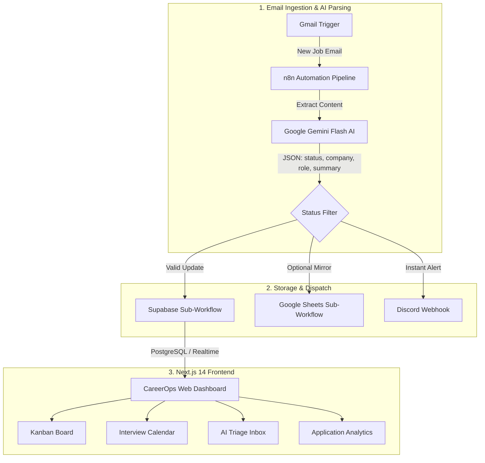

<div align="center">

# 🤖 CareerOps: AI Job Application Tracker & Triage Pipeline

**An intelligent, Linear-inspired job application operating system powered by Next.js 14, Supabase, n8n, Google Gemini AI, and Discord.**

[](https://nextjs.org/)
[](https://react.dev/)
[](https://www.typescriptlang.org/)
[](https://tailwindcss.com/)
[](https://supabase.com/)
[](https://n8n.io/)
[](https://ai.google.dev/)
[](https://discord.com/)

[Overview](#-overview) • [Key Features](#-key-features) • [Architecture](#-architecture) • [Project Structure](#-project-structure) • [Quick Start](#-quick-start) • [Backend & Automation Setup](#-backend--automation-setup) • [Keyboard Shortcuts](#-keyboard-shortcuts)

</div>

---

## 🌟 Overview

Job hunting across dozens of platforms often leads to lost recruiter emails, missed interviews, and fragmented tracking. **CareerOps** solves this by uniting **automated email ingestion** with a **high-speed, desktop-class web dashboard**:

1. **Automated Triage**: An **n8n** pipeline monitors your Gmail for job-related updates.
2. **AI Classification**: **Google Gemini AI** extracts structured metadata (Company, Role, Status, Summary, Next Steps) and calculates a classification confidence score.
3. **Real-time Notifications**: High-priority updates fire immediate color-coded notifications into your private **Discord** channel and in-app sound/desktop alerts.
4. **Hybrid Storage**: Automatically upserts records into **Supabase (PostgreSQL)** and optionally synchronizes with **Google Sheets**.
5. **Linear-Style Frontend**: A modern dark/light mode dashboard built with Next.js 14, Radix UI, and Framer Motion for managing your pipeline across 4 integrated views.

---

## ✨ Key Features

### 📋 1. Classic 5-Column Kanban Board
- **Fluid Drag-and-Drop**: Built with `@hello-pangea/dnd` and dynamic drop indicators.
- **5 Standard Stages**:
  - `Applied` 
  - `Recruiter Reply` 
  - `Interview` 
  - `Offer Received` 
  - `Not Selected` 
- **Inline Card Creation**: Press `N` or click `+ Add Application` to quickly log opportunities.
- **Burn Barrel Zone**: Drag cards to the trash barrel to quickly archive or delete records.

### 📅 2. Synchronized Interview Calendar
- **Automatic Scheduling**: Automatically derives interview rounds, recruiter screens, and offer acceptance deadlines from your Kanban board data.
- **Multi-View Engine**: Switch between **Month**, **Week**, **Day**, and **Agenda List** views.
- **Direct Event Inspection**: Clicking any calendar event instantly pops open the full **Application Detail Modal** with notes, interview history, and recruiter contacts.

### 📥 3. AI Triage Inbox
- **Streamlined Email Triage**: Inspect incoming job communications with full context before merging or updating your board.
- **Confidence & Rationale**: Displays Gemini's reasoning and detection confidence (e.g. `98% - Recruiter proposed interview availability`).
- **One-Click Actions**: Approve detected status, reassign categories, or reject noise in seconds.
- **Dual Stream**: Works with live Supabase data or built-in test fixtures with simulated n8n synchronization.

### 📊 4. Application Analytics & Insights
- **Pipeline Metrics Grid**: Real-time conversion rates, active interview counts, and response ratios.
- **Visual Analytics**:
  - Weekly outreach velocity and goals.
  - Income & compensation range distributions.
  - Top target roles breakdown.
  - Chronological activity log.

### 🔔 5. Real-Time Audio & Desktop Alerts
- Synthesized Web Audio chimes for new status updates and interview notifications.
- Native browser desktop notifications with permission management.
- Live unread badges in the sidebar.

---

## 🏗️ Architecture



---

## 📂 Project Structure

```
.
├── frontend/                               # Next.js 14+ Desktop-Class Web Application
│   ├── src/
│   │   ├── app/                            # App router (layout, page, globals.css)
│   │   ├── components/
│   │   │   ├── KanbanBoard.tsx             # 5-column drag-and-drop board
│   │   │   ├── KanbanCard.tsx              # Individual application cards
│   │   │   ├── LinearHeader.tsx            # Global search, notifications, actions
│   │   │   ├── LinearSidebar.tsx           # Linear-styled navigation & unread counts
│   │   │   ├── ApplicationDetailModal.tsx  # Deep inspection modal & history timeline
│   │   │   ├── ApplicationFormModal.tsx    # Manual application creator
│   │   │   ├── NotificationCenter.tsx      # In-app notification popover
│   │   │   ├── BurnBarrel.tsx              # Drag-to-delete dropzone
│   │   │   ├── ui/                         # Radix UI + Tailwind design system components
│   │   │   └── views/
│   │   │       ├── InterviewCalendar.tsx   # Synced event calendar view
│   │   │       ├── AITriageInbox.tsx       # AI email triage interface
│   │   │       ├── ApplicationAnalytics.tsx# Analytics dashboard hub
│   │   │       ├── inbox/                  # Inbox rows, detail sheets, toolbars
│   │   │       └── analytics/              # Recharts metrics, salary, and role charts
│   │   ├── lib/
│   │   │   ├── supabase.ts                 # Supabase client & database queries
│   │   │   ├── mockData.ts                 # Rich mock dataset (Demo mode)
│   │   │   ├── notificationSound.ts        # Web Audio API alert synthesizer
│   │   │   └── desktopNotification.ts      # Browser Notification API helper
│   │   └── types/
│   │       └── application.ts              # TypeScript domain types & column configs
│   ├── package.json
│   └── .env.example
│
├── n8n/                                    # n8n Automation Workflows
│   ├── job_application_pipeline.json       # Main pipeline (Gmail -> Gemini -> Discord)
│   ├── storage_supabase_subworkflow.json   # Supabase upsert sub-workflow
│   ├── storage_google_sheets_subworkflow.json # Google Sheets sub-workflow
│   ├── google_sheet_template.csv           # Google Sheets header schema
│   └── sample_email_payloads.json          # Test fixtures (interview, offer, rejection)
│
├── platform/
│   └── supabase_schema.sql                 # Production PostgreSQL schema, RPC & indexes
└── README.md                               # System documentation
```

---

## 🚀 Quick Start

### 1. Run the Frontend (Takes 1 minute)

The frontend includes a zero-configuration **Demo Mode** with realistic pre-populated data. You do not need Supabase or n8n configured just to explore the dashboard.

```bash
# 1. Navigate to the frontend directory
cd frontend

# 2. Install dependencies
npm install

# 3. Start the Next.js development server
npm run dev
```

Visit [http://localhost:3000](http://localhost:3000) in your browser.

---

## ⚙️ Backend & Automation Setup

### 2. Connect Supabase (Optional for Live Persistence)

1. Create a project at [supabase.com](https://supabase.com/).
2. Open the **SQL Editor** in Supabase and run the script located at:
   ```
   platform/supabase_schema.sql
   ```
   This creates:
   - `applications` table with hybrid indexes (`thread_id`, `company`, `role`).
   - `application_updates` audit log table.
   - `notifications` table for real-time in-app alerts.
   - `upsert_job_application(...)` stored procedure for seamless thread matching.
3. In `frontend/`, create `.env.local`:
   ```bash
   cp .env.example .env.local
   ```
4. Set your credentials:
   ```env
   NEXT_PUBLIC_SUPABASE_URL=https://your-project.supabase.co
   NEXT_PUBLIC_SUPABASE_ANON_KEY=your-anon-key
   ```
5. Restart the frontend (`npm run dev`). The dashboard will automatically switch from Demo Mode to live database synchronization.

---

### 3. Set Up n8n Automation Pipeline

#### Prerequisites
- A running [n8n instance](https://n8n.io/) (Cloud, Docker, or Desktop).
- A [Google Gemini API Key](https://aistudio.google.com/).
- A [Discord Webhook URL](https://support.discord.com/hc/en-us/articles/228383668-Intro-to-Webhooks).
- Connected Gmail OAuth2 in n8n.

#### Import Workflows
1. In n8n, navigate to **Workflows** → **Import from File**.
2. Import `n8n/job_application_pipeline.json` (Main workflow).
3. Import `n8n/storage_supabase_subworkflow.json` (or `storage_google_sheets_subworkflow.json` if using Sheets).
4. Configure credentials on the imported nodes:
   - **Gmail Trigger**: Link your Gmail account.
   - **Gemini Model**: Select your Google Gemini credential.
   - **Discord Webhook**: Paste your Discord webhook URL into the final notification node.
5. Activate the workflows.

#### Discord Notification Color Key
Incoming updates automatically post rich embeds to Discord:
- 🟢 **Offer Received** (`#2ecc71`): Compensation, role details, and acceptance deadlines.
- 🔵 **Interview Invitation** (`#3498db`): Scheduled rounds, interviewers, and meeting URLs.
- 🟡 **Recruiter Reply** (`#f1c40f`): Follow-up correspondence and updates.
- 🟣 **Application Sent** (`#9b59b6`): Confirmation receipts.
- 🔴 **Not Selected** (`#e74c3c`): Archived applications.

---

## ⌨️ Keyboard Shortcuts & Navigation

| Key / Combination | Action |
|---|---|
| `N` | Open modal to log a new job application |
| `Cmd / Ctrl + K` | Focus global search / command palette |
| `1` | Switch to **My Board** (Kanban) |
| `2` | Switch to **Calendar** view |
| `3` | Switch to **AI Triage Inbox** |
| `4` | Switch to **Analytics** view |
| `Esc` | Close any open modal or sheet |

---

## 🛠️ Tech Stack & Libraries

| Layer | Technology | Purpose |
|---|---|---|
| **Framework** | [Next.js 14](https://nextjs.org/) (App Router) | High-performance React framework with server/client hybrid rendering |
| **Styling** | [Tailwind CSS](https://tailwindcss.com/) + CSS Variables | Pixel-perfect Linear design system with dark/light themes |
| **Primitives** | [Radix UI](https://www.radix-ui.com/) | Accessible dialogs, popovers, select dropdowns, and tooltips |
| **Drag & Drop** | [@hello-pangea/dnd](https://github.com/hello-pangea/dnd) | Fluid Kanban column and card manipulation |
| **Charts** | [Recharts](https://recharts.org/) | Responsive analytics data visualizations |
| **Motion** | [Framer Motion](https://www.framer.com/motion/) | Polished transitions, tab switches, and dialog animations |
| **Database** | [Supabase PostgreSQL](https://supabase.com/) | Relational store with real-time websocket subscriptions & RPC functions |
| **Automation** | [n8n](https://n8n.io/) | Visual node-based pipeline orchestrator |
| **LLM Engine** | [Google Gemini Flash](https://ai.google.dev/) | High-speed structured information extraction & status classification |

---

## 📄 License

This project is open-source and available under the [MIT License](LICENSE).
